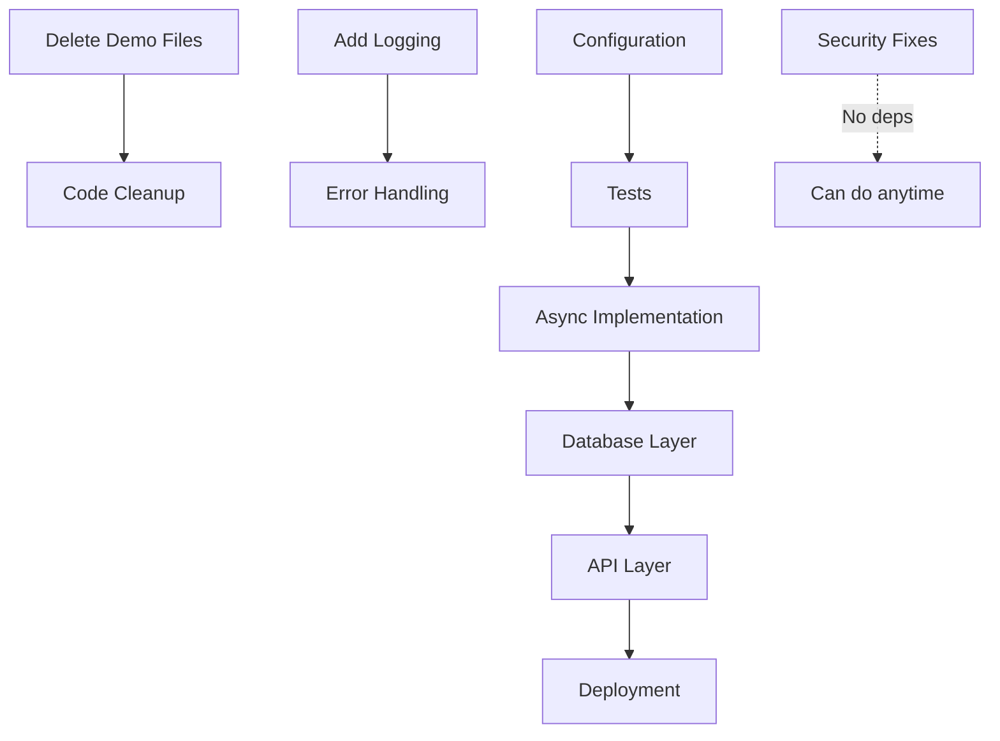

# TASK PRIORITIES - Ordered by Impact & Effort

**Framework**: Eisenhower Matrix + Impact/Effort Scoring  
**Scoring**: Impact (1-10) × Effort (1-10) = Priority Score (higher = more important per hour invested)

---

## Priority Matrix

```
HIGH IMPACT, LOW EFFORT (Do First) ↗️
├── Quick Wins (~3 hours total)
├── Critical Security Fixes (< 1 week)
└── Code Cleanup (< 3 days)

HIGH IMPACT, HIGH EFFORT (Schedule) 📅
├── Database Layer (2 weeks)
├── API Development (2 weeks)
└── UI Overhaul (4 weeks)

LOW IMPACT, LOW EFFORT (Fill Time) 🕐
├── Documentation polish
├── GitHub templates
└── Makefile commands

LOW IMPACT, HIGH EFFORT (Avoid) ⛔
├── Perfect test coverage (90%+)
├── Microservices architecture
└── Advanced analytics
```

---

## Tier 1: DO IMMEDIATELY (This Week)

### 1. Security: Input Sanitization ⚡
**Impact**: 10/10 - Prevents prompt injection attacks  
**Effort**: 2/10 - 4 hours  
**Priority Score**: 5.0  
**Status**: 🔴 CRITICAL

**Task**:
- [ ] Add `bleach` library for HTML sanitization
- [ ] Validate email addresses with `email-validator`
- [ ] Truncate email bodies to 5000 chars
- [ ] Add unit tests for sanitization

**Files to Modify**:
- `src/agents/agent2_extractor.py`
- `src/agents/agent3_verifier.py`

---

### 2. Delete Redundant Demo Files ⚡
**Impact**: 7/10 - Reduces maintenance burden  
**Effort**: 1/10 - 30 min  
**Priority Score**: 7.0  
**Status**: ⚠️ HIGH

**Task**:
- [ ] Delete 9 redundant demo files
- [ ] Consolidate features into `demo_dashboard.py`
- [ ] Update documentation

**Files to Delete**:
- `demo_clear.py`, `demo_collaboration_graph.py`, `demo_final.py`, etc.

---

### 3. Add .env.example ⚡
**Impact**: 5/10 - Helps onboarding  
**Effort**: 1/10 - 5 min  
**Priority Score**: 5.0  
**Status**: 🟡 MEDIUM

**Task**:
- [ ] Create `.env.example` with placeholders
- [ ] Document in README

---

### 4. Replace Print with Logging ⚡
**Impact**: 8/10 - Production-grade logging  
**Effort**: 3/10 - 6 hours  
**Priority Score**: 2.7  
**Status**: ⚠️ HIGH

**Task**:
- [ ] Install `structlog`
- [ ] Create `src/utils/logging.py`
- [ ] Replace all `print()` statements
- [ ] Add log levels (DEBUG, INFO, WARNING, ERROR)

**Files to Modify**: All agent files, `main.py`, `workflow.py`

---

### 5. Add Retry Logic with Exponential Backoff ⚡
**Impact**: 9/10 - Resilience to API failures  
**Effort**: 2/10 - 3 hours  
**Priority Score**: 4.5  
**Status**: 🔴 CRITICAL

**Task**:
- [ ] Install `tenacity`
- [ ] Create `src/utils/retry.py`
- [ ] Wrap all LLM calls with `@retry_llm_call()`
- [ ] Add tests for retry behavior

**Files to Modify**:
- `src/agents/agent2_extractor.py`
- `src/agents/agent3_verifier.py`

---

## Tier 2: DO THIS MONTH (Weeks 2-4)

### 6. Write Comprehensive Tests
**Impact**: 9/10 - Prevents regressions  
**Effort**: 8/10 - 30 hours  
**Priority Score**: 1.1  
**Status**: ⚠️ HIGH

**Task**:
- [ ] Set up pytest infrastructure
- [ ] Write fixtures for mocking LLMs
- [ ] Unit tests for Agent 1 (expand existing)
- [ ] Unit tests for Agent 2 (20+ tests)
- [ ] Unit tests for Agent 3 (20+ tests)
- [ ] Integration tests for workflow
- [ ] Trust Score tests

**Target**: 80%+ code coverage

---

### 7. Add Configuration Management
**Impact**: 7/10 - Eliminates hardcoding  
**Effort**: 3/10 - 4 hours  
**Priority Score**: 2.3  
**Status**: 🟡 MEDIUM

**Task**:
- [ ] Create `src/config/settings.py` using Pydantic
- [ ] Externalize all magic numbers
- [ ] Replace hardcoded paths
- [ ] Add environment-specific configs

---

### 8. Implement Async LLM Calls
**Impact**: 10/10 - 5x speedup  
**Effort**: 6/10 - 12 hours  
**Priority Score**: 1.7  
**Status**: ⚠️ HIGH

**Task**:
- [ ] Convert Agent 2 to async
- [ ] Convert Agent 3 to async
- [ ] Update LangGraph workflow for async
- [ ] Benchmark performance improvement

**Expected Result**: 50 projects in 10 seconds (vs 4 minutes)

---

### 9. Add PostgreSQL Database Layer
**Impact**: 8/10 - Enables scalability  
**Effort**: 8/10 - 40 hours  
**Priority Score**: 1.0  
**Status**: 🟡 MEDIUM

**Task**:
- [ ] Set up SQLAlchemy models
- [ ] Write Alembic migrations
- [ ] Create migration script from JSON → DB
- [ ] Update agents to read/write from DB
- [ ] Add database connection pooling

---

### 10. Build FastAPI Backend
**Impact**: 8/10 - API layer for production  
**Effort**: 7/10 - 32 hours  
**Priority Score**: 1.1  
**Status**: 🟡 MEDIUM

**Task**:
- [ ] Create FastAPI app structure
- [ ] Implement `/api/v1/extract` endpoint
- [ ] Implement `/api/v1/projects` CRUD
- [ ] Add JWT authentication
- [ ] Generate OpenAPI docs
- [ ] Write API integration tests

---

## Tier 3: DO LATER (Month 2+)

### 11. UI Overhaul (Next.js)
**Impact**: 9/10 - Portfolio-quality  
**Effort**: 10/10 - 160 hours  
**Priority Score**: 0.9  
**Status**: 🔵 LOW (but high value)

**Task**:
- [ ] Set up Next.js 14 project
- [ ] Build design system with shadcn/ui
- [ ] Implement responsive layouts
- [ ] Add authentication UI
- [ ] Create interactive graph visualization
- [ ] Add accessibility features (WCAG AAA)

---

### 12. Deploy to Cloud
**Impact**: 7/10 - Makes it live  
**Effort**: 6/10 - 24 hours  
**Priority Score**: 1.2  
**Status**: 🟡 MEDIUM

**Task**:
- [ ] Write Dockerfile
- [ ] Create docker-compose.yml
- [ ] Set up Kubernetes manifests
- [ ] Configure CI/CD with GitHub Actions
- [ ] Deploy to AWS/GCP
- [ ] Set up monitoring (Sentry, Datadog)

---

### 13. Add Neo4j Graph Database
**Impact**: 6/10 - Better graph queries  
**Effort**: 7/10 - 32 hours  
**Priority Score**: 0.9  
**Status**: 🔵 LOW

**Task**:
- [ ] Set up Neo4j instance
- [ ] Write conversion script NetworkX → Neo4j
- [ ] Implement Cypher queries
- [ ] Add graph analytics features

---

## Tier 4: Nice to Have (Backlog)

### 14. Advanced Analytics Dashboard
**Impact**: 5/10  
**Effort**: 8/10  
**Priority Score**: 0.6  

### 15. Real-time Collaboration Features
**Impact**: 4/10  
**Effort**: 9/10  
**Priority Score**: 0.4  

### 16. Multi-tenant Architecture
**Impact**: 6/10  
**Effort**: 9/10  
**Priority Score**: 0.7  

---

## Implementation Roadmap

### Week 1: Foundation & Security
**Total Hours**: 20 hours

```
Day 1-2: Security Fixes
├── Input sanitization (4h)
├── Retry logic (3h)
└── Error handling (3h)

Day 3-4: Code Cleanup
├── Delete demo files (0.5h)
├── Add logging (6h)
└── Configuration management (4h)

Day 5: Quick Wins
├── .env.example (0.5h)
├── Makefile (1h)
├── Pre-commit hooks (1h)
└── Documentation cleanup (2h)
```

### Week 2: Testing & Validation
**Total Hours**: 35 hours

```
Day 1: Test Infrastructure
├── pytest setup (4h)
├── Fixtures and mocks (4h)

Day 2-4: Unit Tests
├── Agent 1 tests (4h)
├── Agent 2 tests (8h)
├── Agent 3 tests (8h)
├── Workflow tests (4h)
└── Trust Score tests (3h)
```

### Week 3: Performance
**Total Hours**: 20 hours

```
Day 1-2: Async Implementation
├── Agent 2 async (6h)
├── Agent 3 async (6h)
└── Workflow async (4h)

Day 3: Caching
├── Redis setup (2h)
├── LLM response cache (4h)
```

### Week 4: Data Layer
**Total Hours**: 40 hours

```
Day 1-2: Database Setup
├── PostgreSQL schema (8h)
├── SQLAlchemy models (8h)
└── Migrations (8h)

Day 3-4: API Development
├── FastAPI setup (4h)
├── Endpoints implementation (8h)
├── Authentication (4h)
```

---

## Priority Scoring Formula

```python
def calculate_priority_score(impact: int, effort: int) -> float:
    """
    Calculate priority score.
    
    Args:
        impact: Business impact (1-10)
        effort: Hours of work required (1-10)
    
    Returns:
        Priority score (higher = more important per hour)
    """
    # Normalize impact (10 = critical, 1 = trivial)
    normalized_impact = impact / 10
    
    # Normalize effort (10 = month+, 1 = <1 hour)
    normalized_effort = effort / 10
    
    # Priority = Impact per unit of effort
    return normalized_impact / normalized_effort if normalized_effort > 0 else 0
```

**Interpretation**:
- Score > 5.0: DO IMMEDIATELY ⚡
- Score 2.0-5.0: DO THIS WEEK/MONTH 📅
- Score 1.0-2.0: DO NEXT MONTH 🔵
- Score < 1.0: BACKLOG ⛔

---

## Task Dependencies



**Critical Path**: Security → Logging → Tests → Async → Database → API → Deploy

---

## Estimated Completion Times

| Milestone | Completion Date | Cumulative Hours |
|-----------|-----------------|------------------|
| Week 1 Complete | Day 5 | 20h |
| Week 2 Complete | Day 10 | 55h |
| Week 3 Complete | Day 15 | 75h |
| Week 4 Complete | Day 20 | 115h |
| Production Ready | Day 30 | 175h |

**Total Investment**: ~175 hours (4-5 weeks full-time)

---

## Success Criteria

### Week 1 ✅
- [ ] Zero hardcoded API keys
- [ ] All print() replaced with logger
- [ ] Input validation on all user inputs
- [ ] Retry logic on all LLM calls

### Week 2 ✅
- [ ] 80%+ test coverage
- [ ] All tests passing
- [ ] CI/CD pipeline running tests

### Week 3 ✅
- [ ] 5x performance improvement
- [ ] Response caching working
- [ ] <30 second pipeline for 100 emails

### Week 4 ✅
- [ ] Database storing all data
- [ ] API endpoints functional
- [ ] JWT authentication working

### Month 2 ✅
- [ ] Deployed to cloud
- [ ] Monitoring in place
- [ ] Production-grade UI

---

## Risk Mitigation

### Risk 1: LLM API Changes
**Probability**: Medium  
**Impact**: High  
**Mitigation**: Abstract LLM interface, maintain version pinning

### Risk 2: Performance Degradation
**Probability**: Low  
**Impact**: Medium  
**Mitigation**: Benchmark before/after each change

### Risk 3: Database Migration Issues
**Probability**: Medium  
**Impact**: High  
**Mitigation**: Comprehensive backup strategy, dry-run migrations

---

## Next Steps

**Immediate Actions** (Start today):
1. ✅ Read AUDIT_REPORT.md thoroughly
2. ✅ Review SECURITY_VULNERABILITIES.md
3. ✅ Implement QUICK_WINS.md (3 hours)
4. ✅ Start Week 1 tasks (security fixes)

**By End of Week**:
- [ ] Complete Tier 1 tasks
- [ ] Begin Tier 2 tasks
- [ ] Update project board with progress

**By End of Month**:
- [ ] Complete Weeks 1-4 roadmap
- [ ] Production deployment ready
- [ ] Portfolio-quality codebase


